## css 物料

在前端开发中，css 为我们的页面带来了生机与活力，我们可以使用它来创建各式各样的场景。如动效、形状、边框、文本等，下面简单介绍一下一些较常用的功能实现。

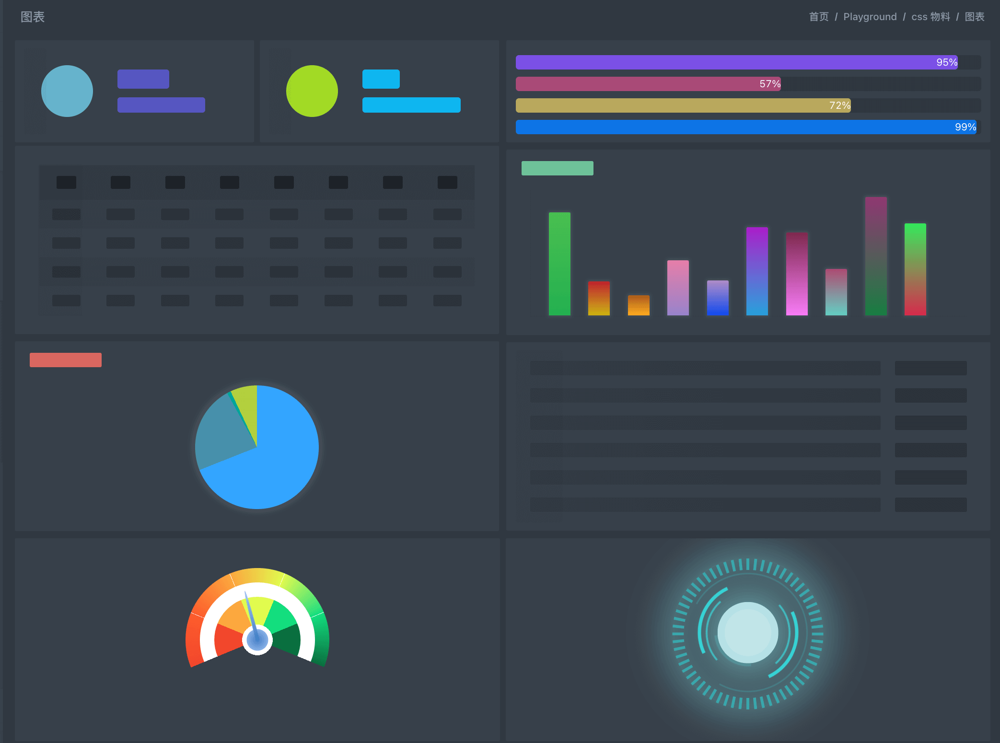

### 动效

css 动效主要有 `animation` 、`transition` 来实现。

#### css 3D

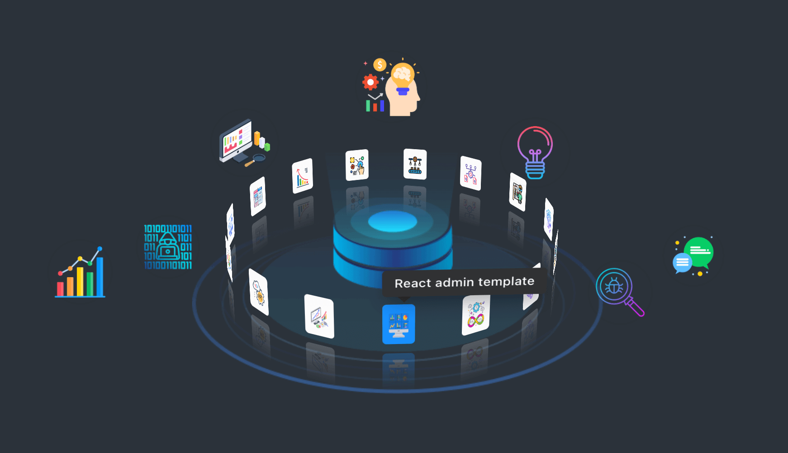

3D 旋转效果。

- perspective 为 3D 转换元素定义透视视图。
- transform-style: preserve-3d; 指定子元素定位在三维空间内。

```css
.model-container {
  position: relative;
  width: 100%;
  height: 100%;
  background-color: transparent;
  transform-style: preserve-3d;
  backface-visibility: hidden;
  animation: huxy-3d-models var(--time) linear 0s infinite;
}

```

#### 3D 卡片

卡片翻转动效。

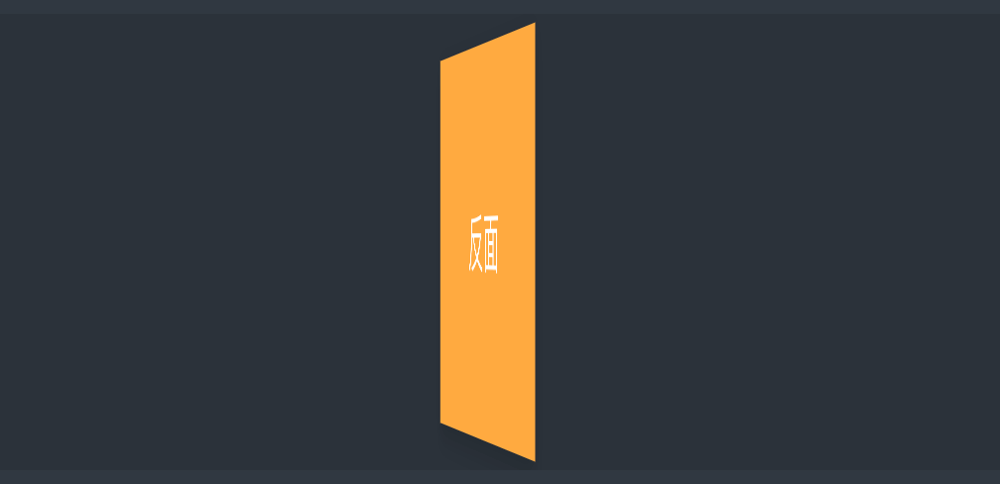

```css
.huxy-card-fliper {
  width: 100%;
  height: 100%;
  position: relative;
  perspective: 1000;
}
.card{
  width: 100%;
  height: 100%;
  position: relative;
  transform-style: preserve-3d;
  transition: transform 0.3s;
}
.front, .back{
  width: 100%;
  height: 100%;
  backface-visibility: hidden;
  position: absolute;
  top: 0;
  left: 0;
}

```

#### 轮播

通过 transform 设置偏移量和大小。

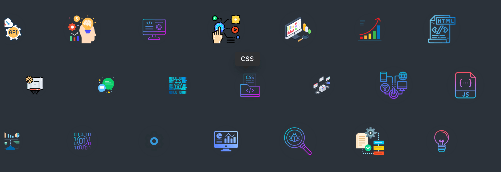

```javascript
const style = {transform: `translate(${item.transform.x}px, ${item.transform.y}px) scale(${item.transform.s})`};

```

#### Loading

加载中效果。

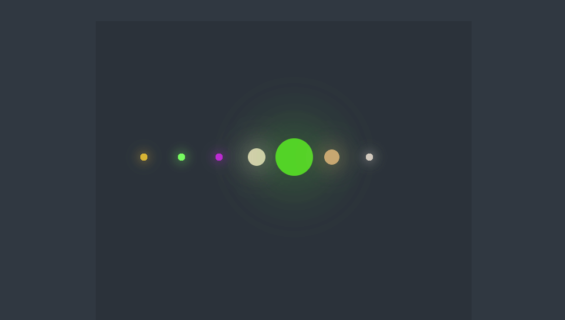

```css
@keyframes huxy-loading-ball {
  0% , 40% , 100%
  {
    transform: scale(0.2);
  }
  20%{
    transform: scale(1);
  }
}

.huxy-loading-ball {
  display: flex;
  .ball {
    background: var(--bgColor);
    box-shadow:0 0 var(--shadowSize) var(--bgColor);
    width: var(--size);
    height: var(--size);
    border-radius: 50%;
    animation: huxy-loading-ball var(--time) ease-in-out var(--delay) infinite;
  }
}
```

#### wave

波浪效果。

```csss
@keyframes huxy-loading-wave {
  0% {
    width: 0;
    opacity: 0.1;
  }
  34% {
    width: 0;
    opacity: 0.5;
  }
  100% {
    width: 100%;
    opacity: 0;
  }
}
.huxy-loading-wave {
  position: relative;
  &::after {
    content: "";
    position: absolute;
    display: block;
    top: 0;
    left: 0;
    height: 100%;
    width: 100%;
    background: var(--waveColor);
    border-radius: 2px;
    opacity: 0;
    animation: huxy-loading-wave var(--waveTime) ease-out infinite;
  }
}

```

### 形状

css 可绘制各种各样形状，主要使用 `box-shadow` 、`border` 、`border-radius` 、`transform` 等属性。

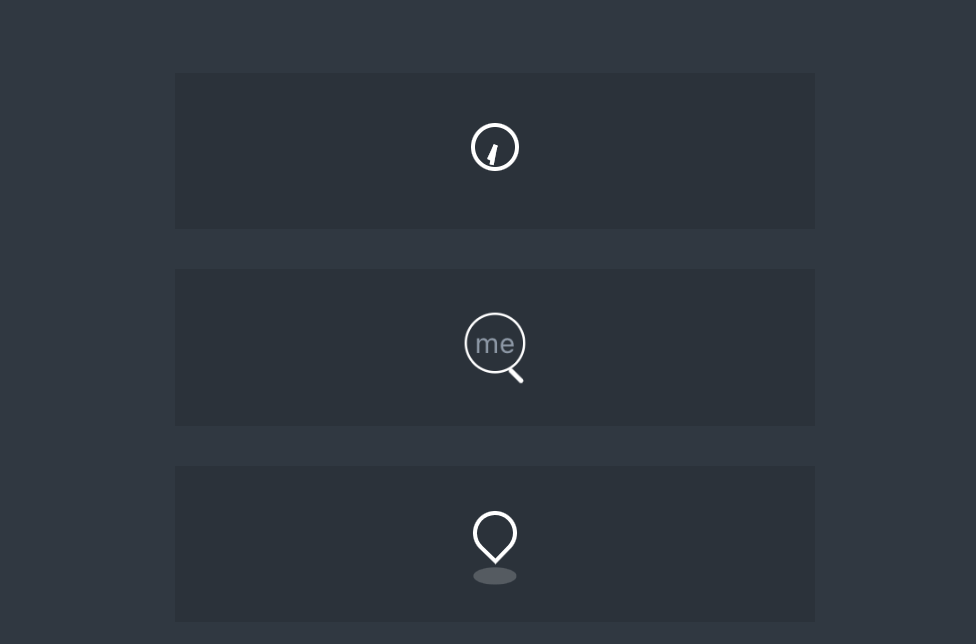

#### time

```css
@keyframes huxy-timer {
  100% {
    transform: rotate(360deg);
  }
}

.huxy-timer {
  width: var(--size);
  height: var(--size);
  position: relative;
  border-radius: 50%;
  box-shadow: inset 0px 0px 0px 2px #fff;
}
.huxy-timer:after,
.huxy-timer:before {
  position: absolute;
  content: "";
  background: var(--color);
  height: var(--handWidth);
  transform-origin: 1px 1px;
  top: calc(var(--size) / 2 - var(--handWidth) / 2);
  left: calc(var(--size) / 2 - var(--handWidth) / 2);
}
.huxy-timer:after {
  width: var(--maxHeight);
  animation: huxy-timer var(--maxTime) linear infinite;
}

.huxy-timer:before {
  width: var(--minHeight);
  animation: huxy-timer var(--minTime) linear infinite;
}

```

#### search

```css
.huxy-search {
  width: var(--size);
  height: var(--size);
  position: relative;
  border-radius: 50%;
  box-shadow: 0px 0px 0px 1px var(--color);
  animation: huxy-search var(--time) linear infinite alternate;
}

.huxy-search:before {
  position: absolute;
  content: "me";
  font-size: 12px;
  left: 50%;
  top: 50%;
  transform: translate(-50%, -50%);
  text-align: center;
}

.huxy-search:after {
  position: absolute;
  content: "";
  width: var(--bar-width);
  height: var(--bar-height);
  background: var(--color);
  bottom: calc(var(--bar-width) - var(--bar-height));
  left: calc(var(--size) - var(--bar-width) * 2);
  border-radius: var(--bar-width);
  transform: rotate(-45deg);
}

```

#### location

```css
@keyframes huxy-location {
  50% {
    top: calc(50% - var(--size) * 0.25);
  }
}
@keyframes huxy-location-back {
  50% {
    transform: translateX(-50%) scale(0.5);
  }
}

.huxy-location {
  position: relative;
  width: var(--size);
  height: var(--size);
}
.huxy-location:before,
.huxy-location:after {
  position: absolute;
  content: "";
}
.huxy-location:before {
  left: 50%;
  top: 50%;
  transform: translate(-50%, -50%) rotate(-46deg);
  width: calc(var(--size) * 0.75);
  height: calc(var(--size) * 0.75);
  border-radius: 100% 100% 100% 0;
  box-shadow: 0px 0px 0px 2px var(--color);
  animation: huxy-location var(--time) linear infinite;
}
.huxy-location:after {
  left: 50%;
  transform: translateX(-50%) scale(1);
  bottom: -50%;
  width: calc(var(--size) * 1.25);
  height: calc(var(--size) * 0.5);
  border-radius: 100%;
  background: var(--bgColor);
  animation: huxy-location-back var(--time) linear infinite;
}

```

#### spot

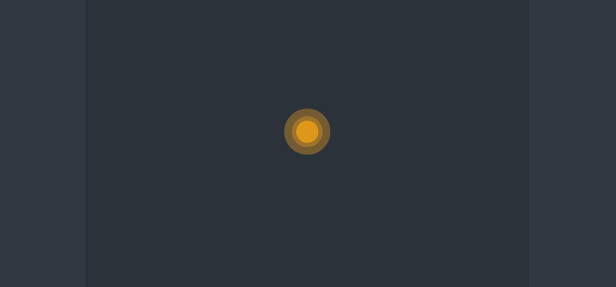

```css
@keyframes huxy-spot {
  0% {
    transform: scale(0.5);
    opacity: 1;
  }
  100% {
    transform: scale(2);
    opacity: 0;
  }
}
.huxy-spot {
  display: inline-block;
  width: var(--size);
  height: var(--size);
  color: var(--color);
  background: currentColor;
  border-radius: 50%;
  position: relative;
}
.huxy-spot:before,
.huxy-spot:after {
  content: "";
  position: absolute;
  background: currentColor;
  border-radius: 50%;
  animation: huxy-spot 1.5s ease-in-out infinite;
}
.huxy-spot:before {
  width: 100%;
  height: 100%;
  left: 0;
  top: 0;
}
.huxy-spot:after {
  width: 150%;
  height: 150%;
  left: -25%;
  top: -25%;
}

```

#### angle

常用于展开与收缩图标。

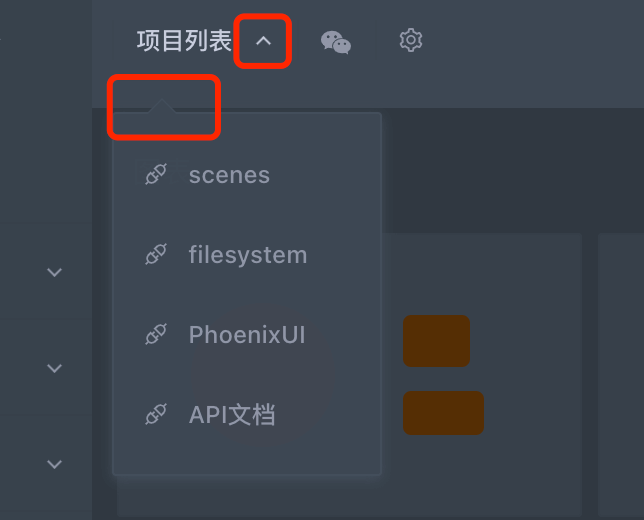

```css
.huxy-angle
  position: relative;
  display: inline-block;
  font-style: normal;
  float: right;
  cursor: pointer;
  height: 100%;
  width: 2 * @angleSize;
  &::before,
  &::after {
    content: "";
    display: block;
    position: absolute;
    border-radius: 1px;
    background-color: currentColor;
    height: @width;
    width: @angleSize;
    left: 0;
    transform-origin: 100% 50% 0;
    transition: all 0.3s;
  }
  &::before {
    left: 0;
  }
  &::after {
    left: calc(@width * 0.7);
  }
}

```

#### arrow

常用于下拉框、提示框等。

```css
.huxy-arrow
  position: relative;
  background: @arrowBgColor;
  border: 1px solid @arrowBorderColor;
  &::before,
  &::after {
    content: "";
    position: absolute;
    width: 0;
    height: 0;
    border: solid transparent;
  }
  &::before {
    border-width: @arrowSize;
  }
  &::after {
    border-width: @arrowSize - @arrowWidth;
  }
}

```

#### follow

常用于选中、active、hover等操作状态。

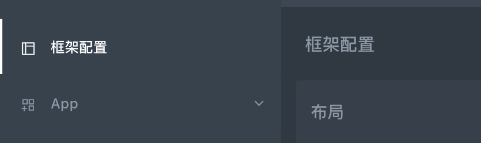

```css
.huxy-follow
  position: relative;
  &::after {
    content: "";
    display: block;
    position: absolute;
    left: @followPadding;
    bottom: 0;
    top: auto;
    height: @followSize;
    width: calc(100% - @followPadding * 2);
    background-color: @followColor;
    transform: scale(0);
    transition: transform 0.3s;
  }
  &.active {
    &::after {
      transform: scale(1);
      transition: transform 0.3s;
    }
  }
}

```

#### 太极图

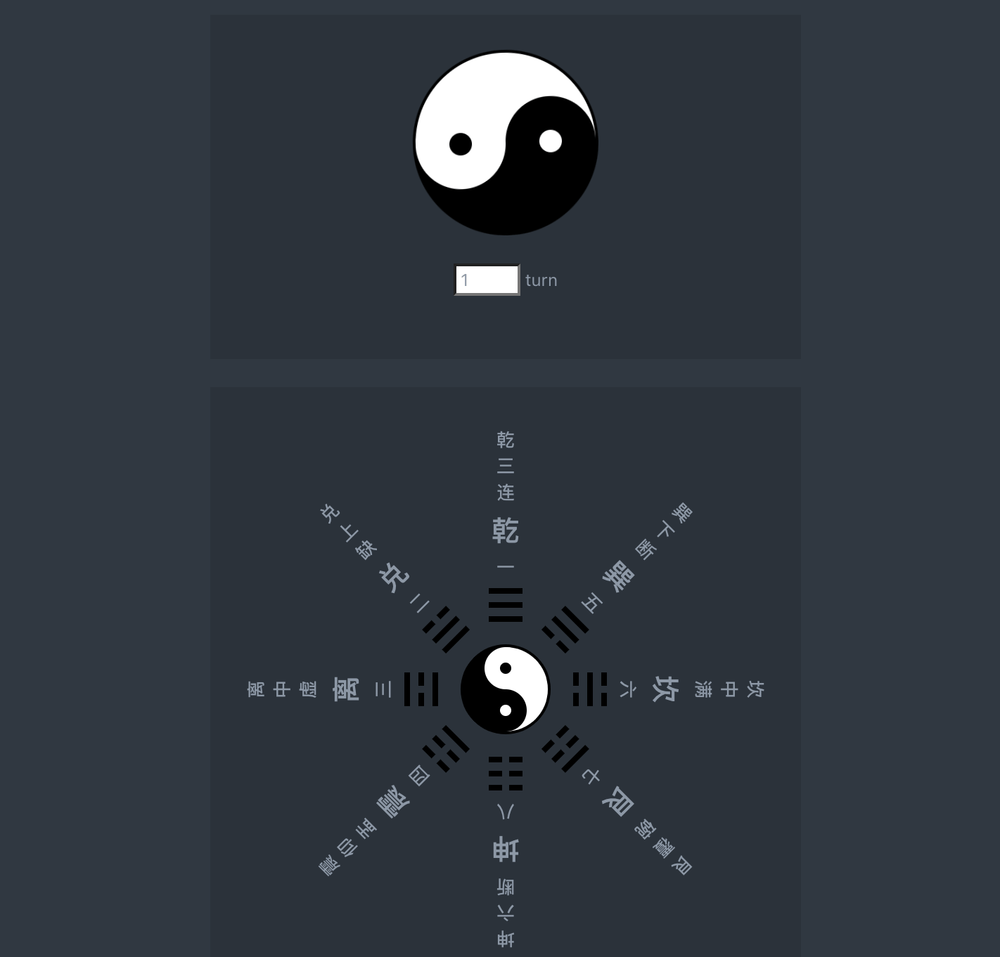

```css
.huxy-taiji {
  box-sizing: content-box;
  position: relative;
  width: var(--width);
  height: calc(var(--width) / 2);
  background: var(--white);
  border-color: var(--black);
  border-style: solid;
  border-width: var(--border) var(--border) calc(var(--width) / 2 + var(--border)) var(--border);
  border-radius: 100%;
  transform: rotate(90deg);
  &::before,
  &::after {
    content: "";
    position: absolute;
    box-sizing: content-box;
    width: calc(var(--width) / 8);
    height: calc(var(--width) / 8);
    border-radius: 100%;
    top: 50%;
  }
  &::before {
    left: 0;
    background: var(--black);
    border: calc(var(--width) * 3 / 16) solid var(--white);
  }
  &::after {
    left: 50%;
    background: var(--white);
    border: calc(var(--width) * 3 / 16) solid var(--black);
  }
}

```

### 图表

css 可绘制一些简单图表，主要使用 `border-radius` 、`conic-gradient` 、`box-shadow`  等实现。

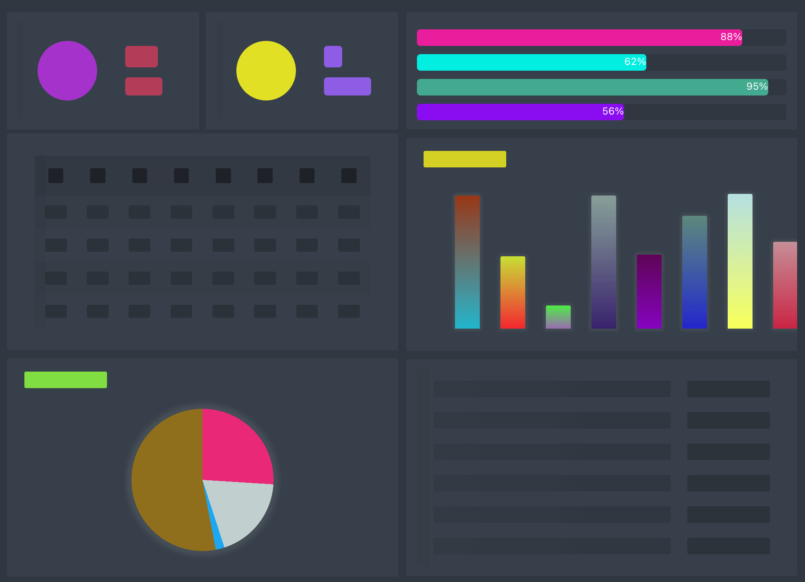

#### card

```css
.huxy-skeleton-card {
  position: relative;
  height: var(--height);
  background: var(--bgColor);
  overflow: hidden;
  .sk-card-left {
    position: absolute;
    left: 0;
    top: 0;
    width: var(--height);
    height: 100%;
    .sk-card-img {
      width: 60%;
      height: 60%;
      border-radius: 50%;
      background: var(--leftColor);
      margin: 20% auto;
    }
  }
  .sk-card-right {
    margin-left: var(--height);
    margin-top: calc(var(--height) * 0.2);
    height: calc(var(--height) * 0.6);
    padding: 0 10px;
    position: relative;
    overflow: hidden;
    .title,
    .text {
      margin: 0;
      border-radius: 4px;
      background: var(--rightColor);
    }
    .title {
      font-size: 2.2rem;
      height: calc(var(--height) * 0.22);
      width: var(--topWidth);
      margin-top: calc(var(--height) * 0.05);
    }
    .text {
      font-size: 1.6rem;
      height: calc(var(--height) * 0.18);
      width: var(--bottomWidth);
      margin-top: calc(var(--height) * 0.1);
    }
  }
}

```

#### progress

```css
.huxy-progress-wave {
  position: relative;
  border-radius: var(--borderRadius);
  height: var(--height);
  background: var(--bgColor);
  overflow: hidden;
  color: #fff;
  &::before,
  &::after {
    content: "";
    position: absolute;
    display: block;
    top: 0;
    left: 0;
    height: 100%;
    width: calc(100% * var(--percent) / 100);
    max-width: 100%;
    border-radius: var(--borderRadius);
    background: var(--progressColor);
    transition: width 1.5s ease-in;
  }
  &::before {
    counter-reset: percent var(--percent);
    content: counter(percent) "%";
    text-align: right;
  }
  &::after {
    background: var(--waveColor);
    opacity: 0;
    animation: huxy-progress-wave var(--waveTime) ease-out infinite;
  }
}

```

#### table

```css
table {
  border-spacing: 0;
  border-collapse: collapse;
  width: 100%;
  th {
    padding: 15px 4%;
    background: var(--thBgColor);
    span {
      display: block;
      height: 18px;
      border-radius: 2px;
      background: var(--thItemColor);
    }
  }
  td {
    padding: 12px 3%;
    span {
      display: block;
      height: 16px;
      border-radius: 2px;
      background: var(--tdItemColor);
    }
  }
  tr {
    transition: background 0.3s;
    &:hover {
      background: var(--hoverColor);
    }
    &:nth-of-type(odd) {
      background: var(--oddColor);
    }
  }
}

```

#### bar

```css
.huxy-skeleton-barchart {
  border-left: 1px solid var(--borderColor);
  border-bottom: 1px solid var(--borderColor);
  height: var(--height);
  position: relative;
  .sk-bar-item {
    --itemHeight: 60%;
    --bgColor: rgba(0, 0, 0, 0.1);
    position: absolute;
    left: 0;
    bottom: 0;
    display: block;
    border-top-left-radius: 2px;
    border-top-right-radius: 2px;
    margin-left: var(--space);
    width: var(--itemWidth);
    height: var(--itemHeight);
    background: var(--bgColor);
    box-shadow: 0 0 4px 2px rgba(255, 255, 255, 0.08);
  }
}

```

#### pie

```css
.huxy-skeleton-piechart {
  width: var(--height);
  height: var(--height);
  background: conic-gradient(var(--color1) 0 var(--percent1), var(--color2) var(--percent1) var(--percent2), var(--color3) var(--percent2) var(--percent3), var(--color4) var(--percent3) var(--percent4));
  border-radius: 50%;
  box-shadow: 0 0 6px 6px rgba(255, 255, 255, 0.08);
}

```

#### list

```css
.huxy-skeleton-list {
  background: var(--bgColor);
  padding: 15px var(--space);
  .sk-list-item {
    position: relative;
    border-radius: 2px;
    height: var(--itemHeight);
    width: calc(100% - var(--rightWidth) - var(--space));
    background: var(--leftColor);
    &::after {
      content: "";
      position: absolute;
      top: 0;
      right: calc(0px - var(--space) - var(--rightWidth));
      border-radius: 2px;
      height: var(--itemHeight);
      width: var(--rightWidth);
      background: var(--rightColor);
    }
    & + .sk-list-item {
      margin-top: calc(var(--space) - 2px);
    }
  }
}

```

#### dashboard

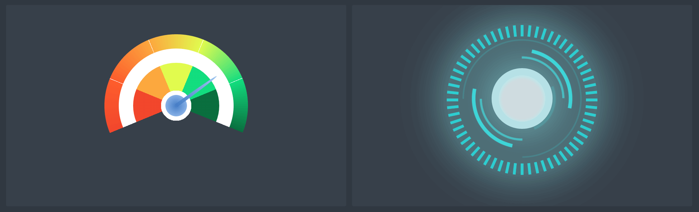

```css
.huxy-skeleton-dashboard {
  --size: 400px;
  --width: 20px;
  --space: 20px;
  --color0: #fff;
  --color1: transparent;
  --color2: #f1462c;
  --color3: #fc5d2c;
  --color4: #fba73e;
  --color5: #e0fa4e;
  --color6: #12dd7e;
  --color7: #0a6e3f;
  position: relative;
  margin: 0 auto;
  border-radius: 50%;
  width: var(--size);
  height: var(--size);
  background: conic-gradient(
    var(--color2) 0%,
    var(--color3) 12.4%,
    var(--color0) 12.4%,
    var(--color0) 12.5%,
    var(--color3) 12.5%,
    var(--color4) 24.9%,
    var(--color0) 24.9%,
    var(--color0) 25%,
    var(--color4) 25%,
    var(--color5) 37.4%,
    var(--color0) 37.4%,
    var(--color0) 37.5%,
    var(--color5) 37.5%,
    var(--color6) 49.9%,
    var(--color0) 49.9%,
    var(--color0) 50%,
    var(--color6) 50%,
    var(--color7) 62.4%,
    var(--color1) 62.4%,
    var(--color1) 62.5%
  );
  transform-origin: 50% 50%;
  transform: rotate(calc(-0.625 * 180deg));
}

```

#### ring

```css
.huxy-animate-border-ring {
  position: relative;
  width: var(--size);
  height: var(--size);
  margin: 0 auto;
  border-radius: 50%;
  .border-ring-item {
    --color: rgba(0, 0, 0, 0.1);
    position: absolute;
    width: var(--itemWidth);
    height: var(--itemHeight);
    background: var(--color);
    top: calc(var(--size) / 2);
    left: 0;
    transform-origin: calc(var(--size) / 2) calc(var(--itemHeight) / 2);
  }
}

```

#### circle

```css
@keyframes huxy-animate-border-circle {
  0% {
    transform: translate(-50%, -50%) rotateZ(var(--rotateStart));
  }
  100% {
    transform: translate(-50%, -50%) rotateZ(var(--rotateEnd));
  }
}

.huxy-animate-border-circle {
  position: relative;
  margin: 0 auto;
  width: var(--size);
  height: var(--size);
  border-radius: 50%;
  box-shadow: 0px 0px 50px 15px var(--shadowInColor), inset 0px 0px 50px 15px var(--shadowInColor);
}
.border-circle-item {
  box-sizing: border-box;
  border-radius: 50%;
  position: absolute;
  width: var(--itemSize);
  height: var(--itemSize);
  left: 50%;
  top: 50%;
  transform: translate(-50%, -50%) rotateZ(var(--rotateStart));
  border: var(--borderWidth) solid transparent;
  animation: huxy-animate-border-circle var(--time) linear infinite;
}

```

### 边框和背景

css 可绘制各种样式背景与边框，主要使用 `linear-gradien` 、`border ` 、`clip-path`  等实现。

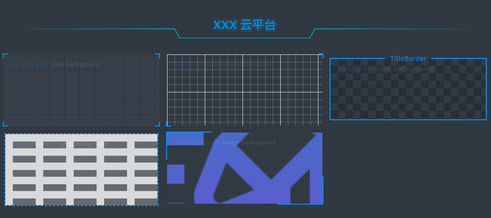

#### 格子背景

```css
.bg-box-grid {
  --bgColor: hsla(0, 0%, 100%, 1);
  --cubeColor: hsla(0, 0%, 100%, 0.3);
  --size: 20% 20%;
  background-image: linear-gradient(var(--bgColor) 15px, transparent 0), linear-gradient(90deg, var(--bgColor) 15px, transparent 0);
  background-size: var(--size);
  background-color: var(--cubeColor);
}

```

#### 虚线格背景

```css
.bg-box-dot {
  background-image: linear-gradient(var(--bgColor) 14px, transparent 0), linear-gradient(90deg, var(--cubeColor) 1px, transparent 0);
  background-size: 15px 15px, 15px 15px;
}

```

#### 图片背景

```css
.bg-box-img {
  background-position: center center;
  background-repeat: no-repeat;
  background-attachment: fixed;
  background-size: cover;
  height:100%;
  width:100%;
  overflow: hidden;
}

```

#### 四个角边框

```css
.corner {
  position: relative;
  background: var(--bgColor);
  border: 2px solid var(--borderColor);
}
.corner:before,
.corner:after {
  content: "";
  display: block;
  position: absolute;
  background-color: transparent;
}
.corner:before {
  top: -2px;
  bottom: -2px;
  left: var(--cornerSize);
  right: var(--cornerSize);
  border-top: 2px solid var(--bgColor);
  border-bottom: 2px solid var(--bgColor);
}
.corner:after {
  left: -2px;
  right: -2px;
  top: var(--cornerSize);
  bottom: var(--cornerSize);
  border-left: 2px solid var(--bgColor);
  border-right: 2px solid var(--bgColor);
}

```

#### 对角边框

```css
.corner-half {
  position: relative;
  border: 2px solid transparent;
}
.corner-half:before,
.corner-half:after {
  content: "";
  display: block;
  position: absolute;
  width: calc(var(--cornerSize) + 2px);
  height: calc(var(--cornerSize) + 2px);
  background-color: transparent;
  z-index: 3;
}
.corner-half:before {
  left: -2px;
  bottom: -2px;
  border-left: 2px solid var(--borderColor);
  border-bottom: 2px solid var(--borderColor);
}
.corner-half:after {
  top: -2px;
  right: -2px;
  border-top: 2px solid var(--borderColor);
  border-right: 2px solid var(--borderColor);
}

```
#### 带标题边框

```css
.huxy-title-border-wrap {
  font-size: var(--fontSize);
  position: relative;
  padding-top: 0.713em;
  .huxy-title-border-top {
    position: absolute;
    top: 0;
    left: 0;
    width: 100%;
    display: flex;
    align-items: center;
    z-index: 3;
    &:before,
    &:after {
      content: "";
      height: var(--borderSize);
      background: var(--borderColor);
      flex-grow: 1;
    }
    &:before {
      margin-right: var(--space);
    }
    &:after {
      margin-left: var(--space);
    }
  }
}

```

#### 虚线滚动边框

```css
@keyframes huxy-border-animate-dash {
  100% {
    background-position: 6% 0, -6% 100%, 0 -6%, 100% 6%;
  }
}
.huxy-border-animate-dash {
  position: relative;
  padding: var(--space);
  box-sizing: border-box;
  border: 1px solid transparent;
  background: linear-gradient(90deg, var(--borderColor) 50%, transparent 0) repeat-x, linear-gradient(90deg, var(--borderColor) 50%, transparent 0) repeat-x, linear-gradient(0deg, var(--borderColor) 50%, transparent 0) repeat-y, linear-gradient(0deg, var(--borderColor) 50%, transparent 0) repeat-y;
  background-size: 8px 2px, 8px 2px, 2px 8px, 2px 8px;
  background-position: 0 0, 0 100%, 0 0, 100% 0;
  animation: huxy-border-animate-dash 0.5s infinite linear;
}

```

#### 对角滚动边框

```css
@keyframes huxy-border-animate-solid {
  0%, 100% {
    clip-path: inset(0% 0% 66% 66%);
  }
  8.33% {
    clip-path: inset(0% 0% 33% 99%);
  }
  16.66% {
    clip-path: inset(33% 0% 0% 99%);
  }
  25% {
    clip-path: inset(66% 0% 0% 66%);
  }
  33.33% {
    clip-path: inset(99% 0% 0% 33%);
  }
  41.66% {
    clip-path: inset(99% 33% 0% 0%);
  }
  50% {
    clip-path: inset(66% 66% 0% 0%);
  }
  58.33% {
    clip-path: inset(33% 99% 0% 0%);
  }
  66.66% {
    clip-path: inset(0% 99% 33% 0%);
  }
  75% {
    clip-path: inset(0% 66% 66% 0%);
  }
  83.33% {
    clip-path: inset(0% 33% 99% 0%);
  }
  91.66% {
    clip-path: inset(0% 0% 99% 33%);
  }
}
.huxy-border-animate-solid::before, .huxy-border-animate-solid::after {
  content: "";
  position: absolute;
  --size: calc(0px - var(--space));
  top: var(--size);
  left: var(--size);
  right: var(--size);
  bottom: var(--size);
  border: 2px solid var(--borderColor);
  border-radius: var(--space);
  animation: huxy-border-animate-solid 6s infinite linear;
}

```

### 文本

css 可绘制各种效果文本，主要使用 `text-shadow` 、`filter ` 、`background-clip`  等属性实现。

#### 3D 文本

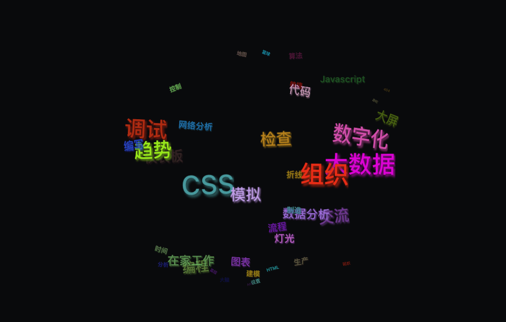

```css
.text-3d-container {
  position: relative;
  width: var(--width);
  height: var(--width);
  transform-style: preserve-3d;
  perspective: 1000px;
  perspective-origin: 50% 50%;
  .text-3d-item {
    position: absolute;
    width: calc(var(--width) - var(--padding) * 2);
    height: calc(var(--width) - var(--padding) * 2);
    left: var(--padding);
    top: var(--padding);
    background-color: transparent;
    transform-style: preserve-3d;
    backface-visibility: hidden;
    transform: rotateX(0deg) rotateY(90deg) rotateZ(var(--current));
    animation: huxy-text-3d var(--time) linear var(--delay) infinite;
    .text-3d-item-card {
      transform-style: preserve-3d;
      transform-origin: 50% 50%;
      width: 100%;
      height: 100%;
      position: absolute;
      left: 0;
      top: 0;
      transform: rotateX(0deg) rotateY(90deg) rotateZ(var(--rotate));
    }
  }
}

```

#### 模糊文本

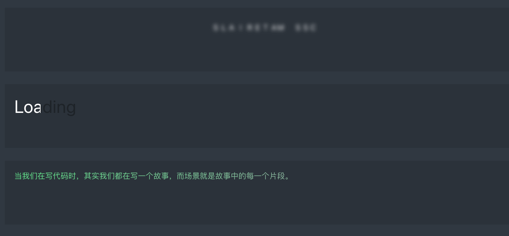

```css
@keyframes huxy-text-filter {
  0% {
    letter-spacing: -2.2rem;
    filter: blur(0.3rem);
  }
  50% {
    filter: blur(0.5rem);
  }
  90%, 100% {
    letter-spacing: 0.5rem;
    filter: blur(0rem);
  }
}

.huxy-text-filter {
  height: 32px;
  position: relative;
  filter: contrast(20);
  overflow: hidden;
}
.text-filter {
  text-transform: uppercase;
  display: block;
  position: absolute;
  left: 50%;
  top: 50%;
  transform: translate3d(-50%, -50%, 0);
  letter-spacing: -2.2rem;
  animation: huxy-text-filter var(--time) infinite alternate ease-in-out;
}

```

#### 文本 loading 效果

```css
@keyframes huxy-text-loading {
  0% {
    max-width: 0;
  }
}
.huxy-text-loading {
  position: relative;
  color: var(--backColor);
  display: inline-block;
  &::before {
    content: attr(data-text);
    position: absolute;
    overflow: hidden;
    max-width: 100%;
    white-space: nowrap;
    color: var(--frontColor);
    animation: huxy-text-loading var(--time) linear infinite;
  }
}

```

#### 文本颜色渐变

```css
@keyframes huxy-text-masked {
  0% {
    background-position: 0 0;
  }
  100% {
    background-position: -100% 0;
  }
}
.huxy-text-masked { 
  background-image: linear-gradient(to right, var(--startColor), var(--endColor) 50%, var(--startColor) 50%, var(--endColor) 100%, var(--startColor));
  background-clip: text;
  -webkit-background-clip: text;
  -webkit-text-fill-color: transparent;
  background-size: 200% 100%;
  animation: huxy-text-masked 2s infinite linear;
}

```

### tooltip

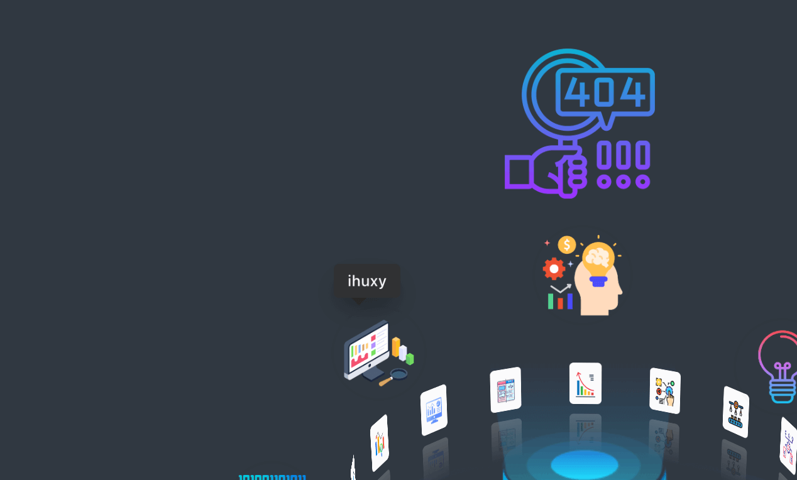

```css
[tooltip] {
  position: relative;
  &::after {
    content: attr(data-tooltip);
    display: none;
    position: absolute;
    bottom: calc(100% + 10px);
    left: 50%;
    transform: translate(-50%, 0);
    padding: 5px;
    border-radius: 4px;
    color: #fff;
    background-color: #313131;
    white-space: nowrap;
    z-index: 1;
  }
  &:hover {
    &::after {
      display: block;
    }
  }
}

```

### 总结

很多时候，不必使用 `js` ，`css` 就可以实现很多功能和效果。以上是从之前实践中简单抽取了一些样式，封装为 css materials ，便于使用。使用方式如下：

```
import {IconAnimate, Css3dModel, Fliper, IconCarousel} from '@huxy/materials';

const Index = props => {
  return (
    <div>
      <div style={box}>
        <IconAnimate objs={animateObjs} models={cssModels} />
      </div>
      <div style={box}>
        <Fliper
          front={<div style={{background: 'var(--blue1)', ...fliperStyle}}>正面</div>}
          back={<div style={{background: 'var(--orange1)', ...fliperStyle}}>反面</div>}
          style={{height: 200, width: 200, margin: '0 auto'}}
        />
      </div>
      <div style={box}>
        <IconCarousel list={models} />
      </div>
    </div>
  );
};

export default Index;
```

以上效果可在 [ihuxy](http://ihuxy.com/playground/materials) 上查看。